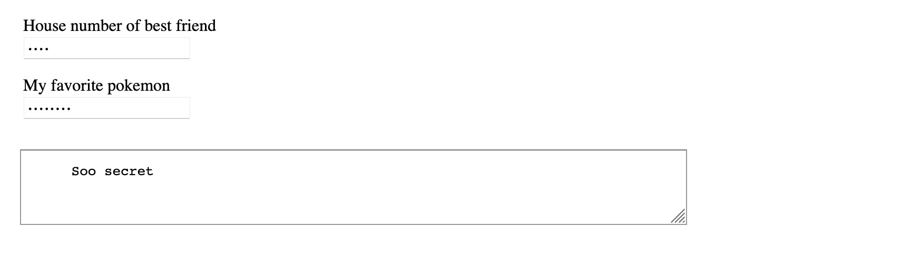

## Questionable Message

*A tool for encrypting messages using a collection of secret answers to public questions.*

Storing a secret in plain sight is challenging, especially if you don't want to rely on obscurity or external systems. This tool offers strong encryption using a key that is generated from a list of answers that you provide.

## How do I use it?

1. Edit the `index.html` file.
2. Replace the `questions` array with your questions.
3. Make sure `ciphertext` is empty.
4. Save and load the `index.html` in your browser.
5. Write your secret message in the textarea.
6. Answer all the questions.
7. Copy the text at the bottom and paste it in `ciphertext`.
8. Save and reload the page.

Your `index.html` is now ready for action. The plaintext message is contained in the file as ciphertext and can only be decrypted using the same answers you gave earlier.

Give it a try to confirm it is working correctly. After typing the correct answers, the message should appear below.

## How many questions should I add?

That depends on how many reasonable answers there are to your questions. To be more precise, it depends on how many answers someone else would assume more likely and therefore guess before guessing your answer. The encryption key we use contains 256 bits, resulting in an astronomical 10^77 combinations, which we aim to recreate by combining multiple answers.

If your question is "My favorite color" and your answer "purple", then there are probably only a handful of colors one would guess before guessing purple. In that case, you need about 100 questions to provide enough combinations to be secure. On the other hand, with a question like "The best pokemon" and your answer "Bergmite", we can reasonably assume at least 500 guesses, which would only require 30 such questions.

This is not an exact science, so use your best judgment and the table below to estimate.

     # Questions | # Answers  | Example question
    -------------+------------+----------------------
             250 |          2 | Chocolate or vanilla
             100 |          6 | My favorite color
              50 |         35 | Name of first pet
              40 |         85 | Where we first met
              30 |        380 | Last name of teacher
              20 |      7,200 | Previous pin number
              10 | 51,000,000 | Strong old password

Also keep in mind that:
- As a rule of thumb, you need at least 20 strong questions.
- What seems unlikely to you can still be an easy guess for someone else.
- What seems like an obvious answer now, can seem far fetched later.
- Answers are case-sensitive; use lower case, avoid punctuation.
- There is more information about you online than you think.
- People close to you might be tricked into sharing these answers.
- You can encrypt multiple messages with the same answers.
- You should not reuse an answer in other places or configurations.

## Why would I need this?

Think of a dystopian thriller about someone with memory loss.

## Can I use this for something important?

No. This is made for fun. Don't use it for anything important or consequential. There are better solutions out there, like password managers and file storage services. True, that is not the same, but at least they know what they are doing.

## Is AES-CBC still considered secure?

It depends. There is the [padding oracle attack](https://en.wikipedia.org/wiki/Padding_oracle_attack), which does not apply in our case. You can change `algorithm` to AES-GCM, which is generally considered to be better.

## How does it work?

In short, the encryption key is generated with SHA256 and the message is encrypted with 256-bit AES-CBC. The following steps are taken to encrypt:

1. Concatenate answers with a newline.
2. Apply SHA256 to get 256-bit encryption key.
3. Generate a random 128-bit IV.
4. Encrypt using AES-CBC.
5. Concatenate IV and cyphertext.
6. Encode with base64.

## How do you know it works?

To confirm the steps are correctly implemented, we can compare the output with what we would get by running the same inputs and steps in the terminal. Below are the steps for reproducing this on macOS with OpenSSL using the same inputs as used in the code and screenshot.

Start by collecting the inputs for the encryption. To obtain the encryption key, concatenate all the answers and compute the SHA256 message digest.

    $ echo -n "5312\nbergmite" | shasum -a 256
    29c13101d0a0583291b51f609568abe199a81a434b82976e7e5eb20b80548f67

To obtain the IV, decode and split the ciphertext.

    $ echo -n PKjpRG0NmvTv+POU/RoNHjWcM7UEs7R4Oc1zIIRUvVM= | base64 --decode | head -c 16 | xxd -p
    3ca8e9446d0d9af4eff8f394fd1a0d1e

Encrypt the message:

    $ echo -n "\n    Soo secret" | openssl enc -aes-256-cbc -iv 3ca8e9446d0d9af4eff8f394fd1a0d1e -K 29c13101d0a0583291b51f609568abe199a81a434b82976e7e5eb20b80548f67 | xxd -p
    359c33b504b3b47839cd73208454bd53

Concat IV and ciphertext, encode.

    $ echo -n $(echo -n 3ca8e9446d0d9af4eff8f394fd1a0d1e)$(echo -n 359c33b504b3b47839cd73208454bd53) | xxd -r -p | base64
    PKjpRG0NmvTv+POU/RoNHjWcM7UEs7R4Oc1zIIRUvVM=

This is the same result as we get from using the program. Finally to decrypt the message:

    $ echo -n "359c33b504b3b47839cd73208454bd53" | xxd -r -p | openssl enc -d -aes-256-cbc -iv 3ca8e9446d0d9af4eff8f394fd1a0d1e -K 29c13101d0a0583291b51f609568abe199a81a434b82976e7e5eb20b80548f67
    Soo secret

While not conclusive proof, these instructions can be used to verify the correct functioning of the program, as well as the underlying cryptographic schema. In the end it is hard to tell whether this provides the security you are looking for. To quote the SubtleCrypto documentation on [MDN Web Docs](https://developer.mozilla.org/en-US/docs/Web/API/SubtleCrypto):

> Even assuming you use the basic cryptographic functions correctly, secure key management and overall security system design are extremely hard to get right, and are generally the domain of specialist security experts.
>
> Errors in security system design and implementation can make the security of the system completely ineffective.

## License

MIT
